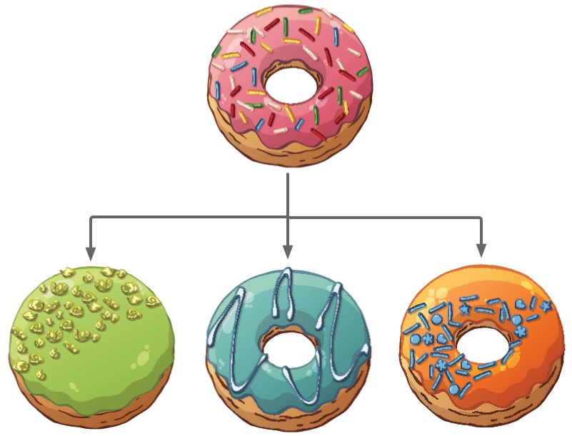
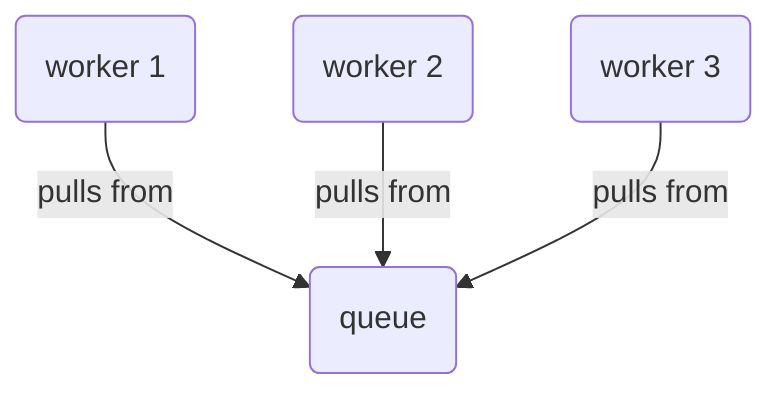

# donut.system



[](https://clojars.org/party.donut/system)

As a developer, one of your tasks is decomposing an application into coherent,
reusable, loosely-coupled components that can be understood and tested in
isolation. Another task is coordinating these components -- composing them in
such a way that system as a whole remains comprehensible and it's
possible to grow, debug, and maintain the application with minimal confusion.

donut.system is a data-driven architecture toolkit for Clojure applications that
helps you manage this source of complexity. With it, you can:

- **Organize your application as a system of components:** We make sense of
  applications by breaking them down into _collections of processes and state
  that produce behavior to achieve some task_ -- aka _components_. Clojure has no
  built-in constructs for defining components. This library fills that gap.
- **Understand your system:** As your application grows, it can be difficult to
  keep track of what components do and how they interact. donut.system provides
  tools for documenting and visualizing your system so that it remains
  understandable as it grows.
- **Easily mock components for tests:** Having a clear and consistent way to
  mock out components to test interactions with e.g. payment processors or email
  servers will make your life easier.
- **Enable more complex reuse:** Reusing pure functions in Clojure is easy.
  Reusing components that combine processes and state, not so much. donut.system
  lays a foundation that makes it possible to reuse not just individual
  components, but groups of components that can produce complex behavior.
- **Manage system start and shutdown:** Components often have to be started and
  stopped in dependency order: your job scheduler might use your database as its
  data store, and therefore can't be started until after your db threadpool is
  created. donut.system makes sure that these behaviors happen in the correct
  order.

[The tutorial](https://donut.party/docs/system/tutorial/) will help you
systematically build your mental model of this tool. The rest of this doc is
organized as a mostly depth-first series of guides that explore every aspect of
working with donut.system.

## Example usage: Define and interact with a system

To use donut.system, you first define a _system_ that contains _component
groups_. Component groups contain _component definitions_. Component definitions
include _signal handlers_ that implement component behaviors.

Systems, component groups, and component definitions are just maps that follow
donut.system's organization scheme. Here's an example of a system definition:

``` clojure
(ns donut.examples.single-component
  (:require
   [donut.system :as ds]))

(def system
  {::ds/defs ;; <-- components defined under this key
   {:app ;; <-- component group name
    {:printer ;; <-- component name
     ;; ::ds/start and ::ds/stop are signal handlers
     #::ds{:start (fn [_]
                    (future
                      (loop []
                        (println "hello!")
                        (Thread/sleep 1000)
                        (recur))))
           :stop  (fn [{:keys [::ds/instance]}]
                    (future-cancel instance))}}}})
```

> **NOTE**: donut.system makes heavy use of _namespaced keywords_. If the
> `#::ds{:start ...}` syntax above is unfamiliar to you, please [read this
> doc](docs/namespaced-keywords.org).

This example defines a var named `system` (the name `system` is arbitrary). Its
value is a map that has one key, `::ds/defs`. This is where your component
definitions live.

The value of `::ds/defs` is a map, where the keys are names for component
groups. In this case, there's only one component group, `:app`. `:app` is an
arbitrary name with no special significance; you can use whatever keywords you
want for component group names.

Under the `:app` component group we have a map where each key is the name of
the component and each value is the component's definition. A component
definition specifies the component's behavior. In this example, the `:printer`
component definition is a map that has two keys, `::ds/start` and `::ds/stop`.
These keys are names of _signal handlers_, which you'll learn about momentarily.
`::ds/start` and `::ds/stop` are both associated with a function. These
functions are where you specify a component's behavior.

Let's interact with the printer system and see its behavior: 

``` clojure
(let [running-system (ds/signal system ::ds/start)]
  (Thread/sleep 5000)
  (ds/signal running-system ::ds/stop))
```

If you run the above in a REPL, it will print `"hello!"` once a second for five
seconds and then stop. The function `ds/signal` takes a system as its argument
and "sends" the signal `::ds/start` to the components in the system, calling the
corresponding signal handler function. This _signal_ and _send_ terminology is
metaphorical; there's no network or sockets or anything like that involved.

The return value of a signal handler becomes the component's _instance._ A
component instance can be some object that you can use to stop the component; In
our printer example the `::ds/start` signal handler returns a future whose
execution we can stop with `future-cancel`.

`(ds/signal system ::ds/start)` returns an updated system map that includes
component instances. If you send another signal to the updated system map, it
can use those instances. In the example above, we call `(ds/signal
running-system ::ds/stop)` to send the `::ds/stop` signal, and its signal
handler cancels the future returned by the `::ds/start` signal handler.

Let's look at a slightly more complicated example. This system has two
components, a `:printer` component and a `:stack` component. When the system
receives the `:donut.system/start` signal, the `:printer` pops an item off the
`:stack` and prints it once a second:

``` clojure
(ns donut.examples.printer
  (:require [donut.system :as ds]))

(def system
  {::ds/defs
   {:services
    {:stack #::ds{:start  (fn [{:keys [::ds/config]}]
                            (atom (vec (range (:items config)))))
                  :config {:items 10}}}

    :app
    {:printer #::ds{:start  (fn [opts]
                              (let [stack (get-in opts [::ds/config :stack])]
                                (future
                                  (loop []
                                    (prn "peek:" (peek @stack))
                                    (swap! stack pop)
                                    (Thread/sleep 1000)
                                    (recur)))))
                    :stop   (fn [{:keys [::ds/instance]}]
                              (prn "stopping")
                              (future-cancel instance))
                    :config {:stack (ds/ref [:services :stack])}}}}})

;; start the system, let it run for 5 seconds, then stop it
(comment
  (let [running-system (ds/signal system ::ds/start)]
    (Thread/sleep 5000)
    (ds/signal running-system ::ds/stop)))
```

As before, `system` is a map that contains just one key, `::ds/defs`.
`::ds/defs` is a map of _component groups_, of which there are two: `:services`
and `:app`. The `:services` group has one component definition, `:stack`, and
the `:app` group has one component definition, `:printer`. 

Component definitions can contain `::ds/start` and `::ds/stop` signal handlers,
as well as a value for `::ds/config`. The `:printer` component's `:ds/config` is
a map that contains a _ref_ to the `:stack` component. Refs allow one component
to refer to and use another component; you'll learn more about them below.

You start the system by calling `(ds/signal system ::ds/start)`. When you send a
signal using `ds/signal`, it calls the corresponding signal handler for all
components in dependency order. In the printer system, `[:app :printer]` depends
on `[:services :stack]`, so `[:services :stack]` is started first.

`ds/signal` returns an updated system map (bound to `running-system`) which you
then use when stopping the system with `(ds/signal running-system :stop)`.

## Foundations

The next couple sections help you fill out your mental model for using
donut.system, both from the concrete, step-by-step behavioral perspective of
what happens when you call the `donut.system/signal` function, and from the
high-level perspective of how the library's designed to help implement your
system's architecture.

### What happens when you call `donut.system/signal`

The main function you'll use is `donut.system/signal` (aliased to `ds/signal`),
and it's possible to understand its behavior in terms of everyday Clojure
functions and data structures, without any reference to the "system" and
"component" concepts the library layers on top.

#### `ds/signal` calls functions that correspond to a keyword

`ds/signal` takes two arguments, a map and a keyword. The map is expected to
have the key `::ds/defs` with a nested map for a value. The keyword is expected
to be `::ds/start`, `::ds/stop`, or a few others.

When you call `ds/signal`, it traverses the _values in the second level_ of the
`::ds/defs` map for any keys that match the keyword passed to `ds/signal`. For
example, if you evaluate this:

```clojure
(ds/signal
 #::ds{:defs
       {:group-a
        {:component-a
         #::ds{:start (fn [_] (println "this gets called!"))
               :stop  (fn [_] (println "this doesn't get called"))}

         :component-b
         #::ds{:start (fn [_] (println "this also gets called!"))
               :stop  (fn [_] (println "this also doesn't get called"))}}}}
 ::ds/start)
```

then these two lines will get printed:

```
this gets called!
this also gets called!
```

The _first_ level of the `::ds/defs` map contains the key `:group-a`. The
_second_ level of the map includes the value for `:group-a`, which is a map that
has the keys `:component-a` and `:component-b`. `ds/signal` looks at the values
at this level for any maps that contain the key `::ds/start`, and if the value
of `::ds/start` is a function then `ds/signal` calls that function.

#### How `ds/signal` handles references

As `ds/signal` traverses `::ds/defs` and calls functions, it keeps track of the
return values of those functions under the system map's `::ds/instances` key.
You can see this by looking at `ds/signal`'s return value:

```clojure
(-> (ds/signal
     #::ds{:defs
           {:group-a
            {:component-a
             #::ds{:start (fn [_] "world")}}}}
     ::ds/start)
    (select-keys #{::ds/defs ::ds/instances}))
   
#::ds{:instances {:group-a {:component-a "world"}}
      :defs      {:group-a {:component-a #::ds{:start (fn [_] "world")}}}}
```

In this case, there's only one instance of a map that includes a `::ds/start`
function. The function returns the string `"world"`, and that gets stored under
`::ds/instances` in a "location" that corresponds with the location of the
function that produced the value: `[:group-a :component-a]`.

`ds/signal` keeps track of these values so you can pass them into other
functions by adding _references_ to them. References are vectors of the form
`[::ds/ref location]`, where `location` is a vector used by `get-in` to get a
value from `::ds/instances`. For example:

```clojure
(ds/signal
 #::ds{:defs
       {:group-a
        {:component-a
         #::ds{:start (fn [_] "world")}

         :component-b
         #::ds{:start (fn [{:keys [::ds/config]}]
                        (println (str "hello, " (:who config) "!")))
               :config {:who [::ds/ref [:group-a :component-a]]}}}}}
 ::ds/start)
```

The second-to-last line has the reference `[::ds/ref [:group-a :component-a]]`.
Here's what now happens when you call `ds/signal`:

1. `ds/signal` "sees" `[::ds/ref [:group-a :component-a]]`. It structures the
   order of `::ds/start` function calls so that the function defined at
   `[::ds/defs :group-a :component-a ::ds/start]` gets called before the one at
   `[::ds/defs :group-a :component-b ::ds/start]`.
2. The function at `[:group-a :component-a ::ds/start]` gets called. It returns
   the value `"world"`
3. This value gets stored under `[::ds/instances :group-a :component-a]`
4. The value at `[::ds/defs :group-a :component-b ::ds/config :who]` gets
   replaced. It was initially `[::ds/ref [:group-a :component-a]]`, but it gets
   replaced with the referenced value, `"world"`
5. The function at `[::ds/defs :group-a :component-b ::ds/start]` gets called,
   and it gets passed one argument. This argument includes the map found at
   `[::ds/defs :group-a :component-b]`, which now includes `{::ds/config {:who
   "world"}}`. The function being called pulls this value out and uses it to
   print `hello, world`.

`ds/signal` continues this process until `::ds/defs` has been fully processed.
This is the core workflow that `ds/signal` executes when you evaluate it.

#### Component instances get passed in to signal handlers

Component instances are included in the map that gets passed to signal handlers
under the `::ds/instance` key. This lets you do things like stop a web server
that you started or perform other stateful operations. Here's a toy example:

``` clojure
(let [started-system (ds/signal
                      #::ds{:defs
                            {:group-a
                             {:component-a
                              #::ds{:start (fn [_] "world")
                                    :stop  (fn [{:keys [::ds/instance]}] (println "Goodbye," instance))}}}}
                      ::ds/start)]
  (ds/signal started-system ::ds/stop))
```

The first call to `ds/signal` returns an updated system map that contains the
string `"world"` at the location `[::ds/instances :group-a :component-a]`. This
value gets passed to the `::ds/stop` function when you call `ds/signal` a second
time, and the result is a message gets printed. (I am now realizing that the
message is somewhat depressing.)

(BTW I know I said I wouldn't use the terms "compoonent" and "signal" in this
section but I couldn't figure out how to explain this otherwise.)

#### System data

The `::ds/defs` map can contain arbitrary data for components to reference:

```clojure
(ds/signal
 #::ds{:defs
       {:env {:who "world"}
        :group-a
        {:component-b
         #::ds{:start (fn [{:keys [::ds/config]}]
                        (println (str "hello, " (:who config) "!")))
               :config {:who [::ds/ref [:env :who]]}}}}}
 ::ds/start)
 ```

This is very similar to the previous example. The difference is that there's now
a path `[:env :who]` under `::ds/defs`, with the value of `"world"`, and the
reference has been updated to point to this new location.

When you call `ds/signal`, it traverses the map under `::ds/defs`. It treats
maps that have the `::ds/start` key in a special manner, calling the function
that the `::ds/start` is paired with. Everything else it finds gets placed in
the corresponding location under `::ds/instances`. So, it finds `"world"` under
`[::ds/defs :env :who]` and places that under `[::ds/instances :env who]`.
`ds/signal` sees the reference `[::ds/ref [:env :who]]` and replaces it with the
instance value, just like in the last section.

#### It's just maps

One cool thing to note is that defining your system and component definitions as
just a nested map means that it's trivial to swap out parts of your system: all
you have to do is use `assoc-in` or some other standard function to transform
the system map.

### Mapping architecture to code

The previous section covered _what_ `ds/signal` does and the data structures it
expects. This section will help you understand _why_ you would want to use it in
the first place.

When we're doing software development at the architecture level, we think and
speak in terms of black-box abstractions like systems, services, modules, and
components. We describe the responsibilities these pieces have and the
relationships among them, e.g. _the system has three worker components which
pull from a message queue component._




How would you write code to capture "my application has three worker components
that pull from a queue"? If you application is small enough, you would likely
just do it directly, possibly with something like this:

```clojure
(def worker-1 (make-worker worker-config))
(def worker-2 (make-worker worker-config))
(def worker-3 (make-worker worker-config))
```

And that's fine! If it works, it works. But over time, as your applications get
larger and you write more of them, you'll find that you'll want to introduce
some structure to handle common concerns when defining components, like
validating their configurations, varying configuration across environment, and
handling startup/shutdown behavior. You'll want to be able to jump into a
colleague's project and reason about it at the component level, exploring what
components are present, how they're related, and how they behave.

In Clojure, there's no standard way to map architecture abstractions to code in
a way that's immediately legible to other developers. "Component" isn't part of
the language in the same way that constructs like vars, protocols, maps, and
vectors are, and there's no recommended way to combine Clojure's built-in
constructs to model architecture.

donut.system provides that model, giving you a clearly-defined way to implement
components and their relationships. The library handles all the concerns you run
into when defining components, including documenting them, configuring them,
validating them, and starting and stopping them. It also provides a
slowly-growing suite of developer tools to explore and interact them, so that
for example you can generate an interactive visual graph of a system to better
understand how everything fits together.

[Example usage: Define and interact with a
system](#example-usage-define-and-interact-with-a-system) shows example
component definitions. This example shows how you might define a system that
includes our queue and workers:

```clojure
(def WorkerComponent
  #::ds{:start (fn [{:keys [::ds/config]}]
                 (start-worker config))
        :config {:queue (ds/local-ref [:queue])}})

(def system
  #::ds{:defs
        {:services
         {:queue #::ds{:start (fn [{:keys [::ds/config]}]
                                (create-queue config))
                       :config {:uri "aws.sqs.etc"}}
          :worker-1 WorkerComponent
          :worker-2 WorkerComponent
          :worker-3 WorkerComponent}}})
```

These docs will explain all this thoroughly, but for now the point is that the
library provides constructs for defining and interacting with systems and
components.

#### Terminology

In mapping architecture to code, donut.system adopts the terms _system_ and
_component_. Both these words are hard to define precisely, but I think most
developers have a rough shared sense of their meaning: systems are the black-box
tools that users use to solve their problems, and components are the internal
bundles of process and state that implement the desired functionality within the
desired quality specifications. If you're building a web app, the system is the
web app and worker and queue components help the web app operate with acceptable
performance.

Within the context of donut.system, the terms _system_ and _component_ can refer
to a few related-but-slightly-different things that span a spectrum from
abstract to concrete. For example, there are at least three different ways to
complete the sentence "A component is a ___" depending on what part of the
abstraction spectrum you're referring to:

- A component is a collection of process and state organized around a behavior
- A component is an organizational unit in the donut.system library
- A component is a map of signal handlers where they keys are signal names and
  the values are the functions to call in response to signals

Context should make it clear which sense of these terms is being used. However,
the last usage -- "a component is a map of signal handlers" -- is potentially
confusing.

It's more precise to say "a component _definition_ is a map of signal handlers".
donut.system does not provide any types or protocols for defining components.
Rather, every time the `donut.system/signal` function encounters a map with a
specific structure (the keys are signal names and the map is found nested under
`[::ds/defs component-group-name component-name]`), it treats that map as a
component definition.

By following this line of reasoning, the `WorkerComponent` var above could more
accurately have been named `WorkerComponentDefinition`. But that feels feels
unwieldy, and `WorkerComponent` is clear enough.

### Summary

donut.system is designed to let you map your architecture to code in a
consistent and reusable way. It does this by providing the `ds/signal` function,
along with a standard structure for defining components (maps with signal names
as keys) and organizing them into a system.

## Basics

Basics cover enough to get you comfortable using donut.system in real-world
projects.

### Components

The term _component_ has many senses across the abstract-to-concrete spectrum.
You can use the word to refer to:

* The abstract notion of a sub-system or module, a separate functioning part of
  a whole, e.g. "components help you organize a system"
* A particular sub-system with its abstract descriptions of processes, state,
  and responsibilities, e.g. "the data fetching component handles caching,
  concurrency, and batching for retrieving business data"
* The definition of that component in code
* A run-time instance of the component produced by its definition

donut.system allows you to translate your system's architectural abstractions
into concrete component definitions and instances. The organizing unit of the
component helps you delineate what collections of processes and state share the
same functional purpose, and to clearly express the dependencies among
components.

Component _definitions_ describe a component's behavior and dependencies.
Behavior is modeled as _signal handling_: to define a component is to define
the function it should call in response to a signal it's sent.

Component _instances_ are whatever objects or values you need to interact with.

#### Component Definitions

Component definitions (or just _defs_ for short) are maps that associate signal
names with signal handlers. Signal names are keywords, and built-in signals
include `:donut.system/start`, `:donut.system/stop`, and more.

Component defs are composed into systems by including them in component groups:

``` clojure
(def Stack
  #::ds{:start  (fn [{{:keys [items]} ::ds/config}] (atom (vec (range items))))
        :config {:items 10}})

(def system {::ds/defs {:services {:stack Stack}}})
```

In this example, we've created a var named `Stack` to define a component. We've
incorporated it into a system under component group name `:services` and the
component name `:stack`.

A few notes about naming and organization:

* The names `:services`, `:stack`, and `Stack` are completely arbitrary. In
  particular, there doesn't have to be any correspondence between the names
  `:stack` and `Stack`.
* You do not have to place component definitions in a separate var. Do whatever
  works best for you to make your code understandable, maintainable, and
  reusable.
* If you do place component definitions in a var, it's recommend to use
  CamelCase for the var's name.
* These docs cover some interesting things you can do with component groups, but
  for now you can just consider them an organizational aid.

#### Signal handlers

A def map contains _signal handlers_. These are used to create component
_instances_ and implement component behavior. A def can also contain additional
configuration values that will get passed to the signal handlers.

In the `Stack` example above, we've defined a `::ds/start` signal handler.
Signal handlers are just functions with one argument, a map. This map includes
the key `::ds/config`, and its value is taken from the `::ds/config` key in your
component definition. With the `Stack` component, that means that the map will
contain `{:items 10}`. You can see that the `::ds/start` signal handler
destructures `::ds/config` out of its first argument, and then looks up
`:items`.

(Other key/value pairs get added to the signal handler's map, and the docs cover
those as needed.)

This approach to defining components lets us easily modify them. If you want to
mock out a component, you just have to use `assoc-in` to assign a new
`::ds/start` signal handler:

``` clojure
(assoc-in system [::ds/defs :services :stack SomeMock])
```

#### Signal handler argument

Signal handlers take a single argument, which will be referred to as... the
signal handler argument. It contains the following keys:

| key                   | value                                                             |
|-----------------------|-------------------------------------------------------------------|
| `::ds/instance`       | The component instance, if it exists                              |
| `::ds/system`         | The entire system map as it exists at that moment                 |
| `::ds/config`         | The value of the component's `::ds/config` with all refs resolved |
| `::ds/component-meta` | Explained below                                                   |
| `::ds/component-id`   | e.g. `[:group-a :component-a]`                                    |

Additionally, the entire resolved component definition gets merged into the
signal handler argument.

#### Component Instances

Signal handlers return a _component instance_, which is stored in the system map
under `::ds/instances`. Example:

``` clojure
(def Stack
  #::ds{:start  (fn [{{:keys [items]} ::ds/config}] (atom (vec (range items))))
        :config {:items 10}})

(def system {::ds/defs {:services {:stack Stack}}})

(::ds/instances (ds/signal system ::ds/start))
;; =>
{:services {:stack #<Atom@5d67ff63: [0 1 2 3 4 5 6 7 8 9]>}}
```

The updated system map stores the atom returned by `[:services :stack]`
component's `::ds/start` signal handler under `[::ds/instances :services
:stack]`.

When donut.system calls a component's signal handler, it passes in that
component's instance under the `::ds/instance` key. So `when you apply the
`::ds/start` signal to a `Stack` component, it creates a new atom, and when you
apply the `::ds/stop` handler the atom is passed in under `::ds/instance` key.
In the example above, the `::ds/stop` signal handler destructures this:

``` clojure
(fn [{::ds/keys [::ds/instance]}] (reset! instance []))
```

This is how you can allocate and deallocate the resources needed for your
system: the `::ds/start` handler will create a new object or connection or
thread pool or whatever, and place that in the system map under
`::ds/instances`. The `::ds/stop` handler can retrieve this instance, and it can
then call whatever functions or methods are needed to to deallocate the
resource.

It's also how you can retrieve system values for tests or when working at the
REPL.

You don't have to define a handler for every signal. Components that don't have
a handler for a signal are essentially skipped when you send a signal to a
system.

#### Warning: Component Organization

Component definitions **must** be defined _as direct children of groups_. The
general form of component definitions is this:

``` clojure
(def system
  {::ds/defs
   {:group-1
    {:component-a #::ds{:start (fn [_])
                        :stop (fn [])}
     :component-b #::ds{:start (fn [_])
                        :stop (fn [])}}

    :group-2
    {:component-c #::ds{:start (fn [_])
                        :stop (fn [])}}}})
```

This does not work:

``` clojure
(def bad-system
  {::ds/defs
   {:group-1
    {:sub-group-1
     ;; component definition is not directly under :group-1
     {:component-a ...}}

    ;; component definition is not in a group
    :component-b ...
    }})
```

`:component-a` and `:component-b` will not be recognized as components. 

Component definitions are organized as direct children under _component groups_,
so that your `::ds/defs` map must follow this structure:

``` clojure
{:component-group-name-1
 {:component-name-1 {...}
  :component-name-2 {...}}

 :component-group-name-2
 {:component-name-1 {...}
  :component-name-2 {...}}}
```

### Refs

Component defs can contains _refs_, references to other components that resolve
to that component's instance when signal handlers are called. Let's look at our
stack printer again:

``` clojure
(def system
  {::ds/defs
   {:services
    {:stack #::ds{:start  (fn [{:keys [::ds/config]}]
                            (atom (vec (range (:items config)))))
                  :config {:items 10}}}

    :app
    {:printer #::ds{:start  (fn [opts]
                              (let [stack (get-in opts [::ds/config :stack])]
                                (future
                                  (loop []
                                    (prn "peek:" (peek @stack))
                                    (swap! stack pop)
                                    (Thread/sleep 1000)
                                    (recur)))))
                    :stop   (fn [{:keys [::ds/instance]}]
                              (prn "stopping")
                              (future-cancel instance))
                    :config {:stack (ds/ref [:services :stack])}}}}})
```

The last line includes `{:stack (ds/ref [:services :stack])}`. `ds/ref` is a
function that returns a vector of the form `[:donut.system/ref component-key]`,
where `component-key` is a vector of the form `[group-name component-name]`.

These refs are used to determine the order in which signals are applied to
components. Since the `:printer` refers to the `:stack`, we know that it depends
on a `:stack` instance to function correctly. Therefore, when we send a
`:start` signal, it's handled by `:stack` before `:printer`.

Within `:printer`'s `:start` signal handler, `stack` refers to the atom created
by the `:stack` component.

When you call `(ds/signal system ::ds/start)`, the following happens:

1. The `::ds/start` signal handler for `[:services :stack]` gets called. It
   returns an atom, which becomes the component instance for `[:services
   :stack]`.
2. Internally, that atom is added to the system map under `[::ds/instances
   :services :stack]`.
3. The `::ds/start` signal handler for `[:app :printer]` gets called with a
   single argument, a map. That map includes the key path `[::ds/config
   :stack]`, and its value is the component instance for `[:services :stack]` --
   the atom created at step 1.

#### Deep refs

If you have a component `[:group-a :component-a]` whose instance is a map like
`{:level-1 {:level-2 {:level-3 ...}}}` then you can refer to values within the
map with a ref like `(ds/ref [:group-a :component-a :level-1 :level-2
:level-3])`.

#### Refs must be reachable

Note that a ref must be _reachable_ for it to be resolved, meaning that it must
be possible to use `(get-in system [::ds/defs :path :to :ref])` to retrieve the
ref. Something like this wont' work:

``` clojure
{::ds/defs {:app {:printer #::ds{:start (fn [_] (ds/ref [:services :stack]))}}}}
```

It won't work because `ds/ref` resides inside a function definition that
isn't reachable by `(get-in system [:app :printer ::ds/start])`.

### System data

If a component is defined using any value other than a map that contains the
`:donut.system/start` key, that value is considered _system data_ which can be
referenced using refs. This can be useful for configuration. Consider this
system:

``` clojure
(ns donut.examples.ring
  (:require [donut.system :as ds]
            [ring.adapter.jetty :as rj]))

(def system
  {::ds/defs
   {:env  {:http-port 8080}
    :http {:server  #::ds{:start  (fn [{{:keys [handler options]} ::ds/config}]
                                    (rj/run-jetty handler options))
                          :stop   (fn [{::ds/keys [instance]}]
                                    (.stop instance))
                          :config {:handler (ds/local-ref [:handler])
                                   :options {:port  (ds/ref [:env :http-port])
                                             :join? false}}}
           :handler (fn [_req]
                      {:status  200
                       :headers {"ContentType" "text/html"}
                       :body    "It's donut.system, baby!"})}}})
```

The component `[:env :http-port]` is defined as the value `8080`. It's referred
to by the `[:http :server]` component. When the `[:http :server]`'s `:start`
handler is applied, it destructures `options` from its first argument. `options`
will be the map `{:port 8080, join? false}`.

This is just a little bit of sugar to make it easier to work with donut.system.
It would be annoying and possibly confusing to have to write something like

``` clojure
(def system
  {::ds/defs
   {:env {:http-port #::ds{:start (constantly 8080)}}}})
```

### Signals

We've seen how you can specify signal handlers for components, but what is a
signal? The best way to understand them is behaviorally: when you call the
`ds/signal` function on a system, then each component's signal handler gets
called in the correct order. I needed to convey the idea of "make all the
components do a thing", and signal handling seemed like a good metaphor.

Using the term "signal" could be misleading, though, in that it implies the use
of a communication primitive like a socket or a semaphor. That's not the case.
Internally, it's all just plain ol' function calls. If I talk about "sending" a
signal, nothing's actually being sent. And anyway, even if something were
getting sent, that shouldn't matter to you in using the library; it would be an
implementation detail that should be transparent to you.

donut.system provides some sugar for built-in signals: instead of calling
`(ds/signal system ::ds/start)` you can call `(ds/start system)`.

### Custom signals

There's a more interesting reason for using the term _signal_, though: I want
signal handling to be extensible. Other component libraries use the term
_lifecycle_, which I think doesn't convey the sense of extensibility that's
possible with donut.system.

Out of the box, donut.system recognizes `::ds/start`, `::ds/stop`,
`::ds/suspend`, and `::ds/resume` signals, but it's possible to handle arbitrary
signals -- say, `:your.app/validate` or `:your.app/status`. To do that, you just
need to add a little configuration to your system:

``` clojure
(def system
  {::ds/defs    {;; components go here
                 }
   ::ds/signals {:your.app/status   {:order :topsort}
                 :your.app/validate {:order :reverse-topsort}}})
```

**`::ds/signals`** is a map where keys are signal names and values are
configuration maps. The configuration keys are:

**`:order`** values can be `:topsort` or `:reverse-topsort`. This specifies the
order that components' signal handlers should be called. `:topsort` means that
if Component A refers to Component B, then Component A's handler will be called
first; reverse is, well, the reverse.

**`:returns-instance?`** this determines whether the return value of the signal
handler should be used to update the system's instances, under `::ds/instances`.

The map you specify under `::ds/signals` will get merged with the default signal
map, which is:

``` clojure
(def default-signals
  "which graph sort order to follow to apply signal, and where to put result"
  {::start   {:order             :reverse-topsort
              :returns-instance? true}
   ::stop    {:order             :topsort
              :returns-instance? true}
   ::suspend {:order             :topsort
              :returns-instance? true}
   ::resume  {:order             :reverse-topsort
              :returns-instance? true}
   ::status  {:order :reverse-topsort}})
```

### Systems

Systems organize components and provide a consistent way to initiate component
behavior. You send a signal to a system, and the system ensures its components
handle the signal in the correct order.

As you've seen, systems are implemented as maps. I sometimes refer to these maps
as _system maps_ or _system states_. It can be useful, for example, to think of
`ds/signal` as taking a system state as an argument and returning a new state.

donut.system follows a pattern that you might be used to if you've used
interceptors: it places as much information as possible in the system map and
uses that to drive execution. This lets us do cool and useful stuff like define
custom signals.

One day I'd like to write more about the advantages of taking the "world in a
map" approach. In the mean time, [this Lambda Island blog post on Coffee
Grinders](https://lambdaisland.com/blog/2020-03-29-coffee-grinders-2) does a
good job of explaining it.

### Per-environment system configuration

`donut.system/named-system` is a multimethod you can use to register system
maps. This can be useful for defining dev, test, and prod systems:

``` clojure
(defmethod ds/named-system :test
  [_]
  {::ds/defs ...})
```

Often you'll want to customize a config; you'll want to replace a component with
a mock, for example. You can pass an additional argument to `ds/system` to
specify overrides:

``` clojure
(ds/system :test {[:services :queue] mock-queue})
```

You don't have to override an entire component. You can also override just a
signal handler:

``` clojure
(ds/system :test {[:services :queue ::ds/start] (fn mock-start-queue [_])})
```

Overrides are a map where keys are _def paths_, and values are whatever value
you want to be assoc'd in to that path under `::ds/defs`. The above code is
equivalent to this:

``` clojure
(update (ds/named-system :test)
        ::ds/defs
        (fn [defs]
          (reduce-kv (fn [new-defs path val]
                       (assoc-in new-defs path val))
                     defs
                     {[:services :queue :start] (fn mock-start-queue [_])})))
```

The signal helpers `ds/start`, `ds/stop`, `ds/suspend`, and `ds/resume` can take
either a system name or a system map, and can take optional overrides:

``` clojure
(ds/start :test) ;; <- system name
(ds/start {::ds/defs ...}) ;; <- system map

;; use named system, with overrides
(ds/start :test {[:services :queue] mock-queue})
```

The `start` helper also takes an optional third argument to select a subset of components start:

``` clojure
(ds/start :test 
          {[:services :queue] mock-queue}
          #{[:app :http-server]}) ;; <- component selection
```

Component selection is explained below.

### Reloaded REPL workflow

The `donut.system.repl` namespace has conveniences for REPL workflows. By
default, it will start and stop a named-system named `:donut.system/repl`, but
you can also specify a system:


``` clojure
(require '[donut.system :as ds])
(require '[donut.system.repl :as dsr])

;;---
;; By default, the named-system :donut.system.repl is used

(defmethod ds/named-system :donut.system/repl
  [_]
  {::ds/defs {:group {:component {::ds/start (fn [_] (println "starting :donut.system/repl"))
                                  ::ds/stop (fn [_] (println "stopping :donut.system/repl"))}}}})

(dsr/start)
;; => starting :donut.system/repl

(dsr/stop)
;; => stopping :donut.system/repl

;; you can still override components
(dsr/start {[:group :component ::ds/start] (fn [_] (println "override"))})
;; => override

;;---
;; You can also use a different named-system

(defmethod ds/named-system :dev
  [_]
  {::ds/defs {:group {:component {::ds/start (fn [_] (println "starting :dev"))
                                  ::ds/stop (fn [_] (println "stopping :dev"))}}}})

(dsr/start :dev)
;; => starting :dev

(dsr/stop)
;; => stopping :dev

;; you can still override components
(dsr/start :dev {[:group :component ::ds/start] (fn [_] (println "override dev"))})
;; => override dev
```

`donut.system.repl/restart` will:

1. Stop the running system
2. Call `(clojure.tools.namespace.repl/refresh :after 'donut.system.repl/start)`

This will reload any changed files and then start your system again.

#### Reloaded REPL with beholder

You can use the library [beholder](https://github.com/nextjournal/beholder) to
watch your file system for changes and automatically reload changes and restart
your system while you're developing it. Here's how I do it:

First, create the file `dev/src/user.clj` and put this in it:

``` clojure
(ns user)

(defn dev
  "Load and switch to the 'dev' namespace."
  []
  (require 'dev)
  (in-ns 'dev)
  :loaded)
```

Then create `dev/src/dev.clj` and put this in it:

``` clojure
(ns dev
  {:clj-kondo/config {:linters {:unused-namespace {:level :off}}}}
  (:require
   [clojure.tools.namespace.repl :as nsrepl]
   [dev.repl :as dev-repl]
   [donut.system :as ds]
   [donut.system.repl :as dsr]
   [donut.system.repl.state :as dsrs]
   [fluree.http-api.system :as sys])
  (:refer-clojure :exclude [test]))

(nsrepl/set-refresh-dirs "dev/src" "src" "test")

(def start dsr/start)
(def stop dsr/stop)
(def restart dsr/restart)

(defmethod ds/named-system :donut.system/repl
  [_]
  (ds/system :dev))

;; start the system when the dev namespace gets loaded
(when-not dsrs/system
  (dsr/start))
```

Next create `dev/src/dev/repl.clj` and put this in it:

``` clojure
(ns dev.repl
  (:require [clojure.tools.namespace.repl :as repl]
            [donut.system.repl :as dsr]
            [nextjournal.beholder :as beholder]))

(repl/disable-reload!)

(defonce persistent-state (atom {}))

(defn- source-file? [path]
  (re-find #"(\.cljc?|\.edn)$" (str path)))

(defn- restart*
  [path]
  (when (source-file? path)
    (try
      (dsr/restart)
      (catch Exception e
        (println "Exception reloading:")
        (println e)))))

(defn- restart [ns]
  (fn [{:keys [path]}]
    (binding [*ns* ns]
      (restart* path))))

(def watcher
  (beholder/watch (restart *ns*) "src" "resources" "dev/src" "test"))

(comment
  (beholder/stop watcher))
```

and merge this configuration into your `deps.edn` file:

``` clojure
{:aliases
 {:dev
  {:extra-paths ["dev/src" "test"]
   :extra-deps  {com.nextjournal/beholder    {:mvn/version "1.0.0"}
                 org.clojure/tools.namespace {:mvn/version "1.1.0"}}}}}
```

By "merge" I mean that if you already have a `:dev` alias, add the values to it
in a way works for your project.

Once you've done this, you start a REPL with the `:dev` alias. If you use emacs,
you can add the following to your .emacs.d to have CIDER always include the dev
alias for REPLs:

``` clojure
(setq cider-clojure-cli-aliases ":dev")
```

After the REPL has started, call the `(dev)` function from the `user` namespace,
which is the default namespace. Calling `(dev)` will load the `dev` namespace
and switch to it, then start your system. It will also get beholder to do its
thing, watching the filesystem and reloading your namespaces and restarting your
system.

### Handling Failures

As you develop your project, it's likely an exception will get thrown when
you're trying to start your system. This can cause some resources to be claimed
without an obvious way to recover them. For example, your system might start an
HTTP server on port 8080, then throw an exception, leaving you without a clear
way to stop the HTTP server.

You can try to stop a failed system with the function
`donut.system/stop-failed-system`. Here's its source:

``` clojure
(defn stop-failed-system
  "Will attempt to stop a system that threw an exception when starting"
  []
  (when-let [system (and *e (::system (ex-data *e)))]
    (stop system)))
```

If you're trying to start a system using `donut.system.repl/start`, it will
automatically try to stop a failed system if an exception gets thrown.

### Organization and configuration

Where do you actually put your donut.system-related code? And how do you
handle configuration?

I recommend creating a `your-project.system` namespace to define your base system. It
might look something like this:

``` clojure
(ns you-project.system
  (:require
   [aero.core :as aero]
   [clojure.java.io :as io]
   [donut.system :as ds]
   [ring.adapter.jetty :as rj]))

;; Use aero for all configuration
(defn env-config [& [profile]]
  (aero/read-config (io/resource "config/env.edn")
                    (when profile {:profile profile})))

;; define all behavior in base-system
(def base-system
  {::ds/defs
   {:env {}

    :http
    {:server
     #::ds{:start  (fn [{{:keys [handler options]} ::ds/config}]
                     (rj/run-jetty handler options))
           :stop   (fn [{::ds/keys [instance]}]
                     (.stop instance))
           :config {:handler (ds/ref [:http :handler])
                    :options {:port  (ds/ref [:env :http-port])
                              :join? false}}}

     :handler
     #::ds{:start (fn [_]
                    ;; handler goes here
                    )}}}})

(defmethod ds/named-system :base
  [_]
  base-system)

(defmethod ds/named-system :dev
  [_]
  (ds/system :base {[:env] (env-config :dev)}))

(defmethod ds/named-system :donut.system/repl
  [_]
  (ds/system :dev))

(defmethod ds/named-system :test
  [_]
  (ds/system :dev
    {[:http :server] ::disabled}))
```

Note that this system contains an `:env` group. Other components can reference
values in the `:env` group for their configuration. The `[:http :server]`
component does this for its port.

Additionally, refs can "reach" farther into the referenced component. For
example, this would work:

``` clojure
(def base-system
  {::ds/defs
   {:env
    {:http {:port 8080}}

    :http 
    {:server
     #::ds{:start  (fn [{{:keys [handler options]} ::ds/config}]
                     (rj/run-jetty handler options))
           :config {:handler (ds/ref :handler)
                    :options {:port  (ds/ref [:env :http :port])
                              :join? false}}}}}})
```

Note the second-to-last-line includes `(ds/ref [:env :http :port])` - this will
correctly reference the HTTP port.

As your system grows, you'll probably want to move components into separate
namespaces. Your system map might then look something like this:

``` clojure
(def base-system
  {::ds/defs
   {:env {}

    :http 
    {:server  http/server
     :handler http/handler}}})
```

### Testing

How do you test an application that uses donut.system? There are three main
concerns:

- Starting and stopping your system
- Accessing component instances
- Mocking components

Let's look at each, using this test system:

``` clojure
(defmethod ds/named-system ::test
  [_]
  {::ds/defs
   {:group-a
    {:component-a
     {::ds/start (fn [_] (atom []))}}

    :group-b
    {:component-b
     {::ds/start  (fn [opts]
                    ;; add an element to the `[:group-a :component-a]` atom on
                    ;; start
                    (swap! (get-in opts [::ds/config :component-a])
                           conj
                           :foo))
      ::ds/config {:component-a (ds/ref [:group-a :component-a])}}}}})
```

#### Starting and stopping your system

There are three main options you can choose from to start and stop your system:

##### Method 1: use a `let` binding

``` clojure
(deftest your-test
  (let [system (ds/start ::test)]
    (is (= [:foo]
           @(get-in system [::ds/instances :group-a :component-a])))
    (ds/stop system)))
```

##### Method 2: `with-*system*`

The `donut.system` namespace has a dynamic var, `*system*`, and a macro that
handles some of the machinery of working with it:

``` clojure
(deftest using-with-*system*
  (ds/with-*system* ::test
    (is (= [:foo]
           @(get-in ds/*system* [::ds/instances :group-a :component-a])))))
```

The macro's first argument is either a system map or a system name. The macro
will start the system and bind the started system map to `ds/*system*`. It will
also stop the system.

##### Method 3: `system-fixture`

The function `ds/system-fixture` returns a function that can be used as a
`clojure.test` fixture:

``` clojure
(use-fixtures :each (ds/system-fixture ::test))

(deftest using-fixture
  (is (= [:foo]
         @(get-in ds/*system* [::ds/instances :group-a :component-a]))))
```

Just be careful not to mix this method with method 2. If you do that you'll end
up starting two different systems, and that could cause hard-to-debug problems.

#### Accessing component instances

Once you have a started system, you can access component instances under the
system's `::ds/instances` key. You can also use the function `ds/instance`:

``` clojure
(deftest retrieving-instances
  (ds/with-*system* ::test
    ;; one way to retrieve an instance
    (is (= [:foo]
           @(get-in ds/*system* [::ds/instances :group-a :component-a])))

    ;; another way to retrieve an instance
    (is (= [:foo]
           @(ds/instance ds/*system* [:group-a :component-a])))))
```

The advantage of using `ds/instance` is that it will throw an exception if
you're trying to get an instance for an undefined component, which can help you
catch typos.

#### Mocking Components

When you're writing tests, you'll sometimes want to mock out components. For
example, if you have an Amazon SQS queue, you might want to mock out the client rather
than trying to connect to an actual SQS queue over the network. When you use the
`ds/start` or `ds/system` functions, you can provide a map of component
overrides, as covered above in the [config helpers](#config-helpers) section.
Here's what that might look like:

``` clojure
(deftest with-override
  ;; method 1
  (let [test-atom (atom [])]
    (ds/start ::test {[:group-a :component-a] test-atom})
    (is (= [:foo] @test-atom)))

  ;; method 2 - the first argument to `ds/with-*system*` can be either a system
  ;; name or a system map. In this example we're getting a system map.
  (let [test-atom (atom [])]
    (ds/with-*system* (ds/system ::test {[:group-a :component-a] test-atom})
      (is (= [:foo] @test-atom)))))
```

## Advanced usage

The topics covered so far should let you get started defining components and
systems in your own projects. donut.system can also handle more complex use
cases.

### Groups and local refs

All component definitions are organized into groups. As someone who compulsively
lines up pens and straightens stacks of brochures, I think this extra level of
tidiness is inherently good and needs no further explanation.

The inclusion of component groups unlocks some useful capabilities that are less
obvious, though, so let's talk about those. Component groups make it easier to:

- Create multiple instances of a component
- Send signals to selections of components
- Designate system stages

I'll describe what I mean by "multiple instances" here, and I'll explain the
rest in later sections.

Let's say for some reason you want to run multiple HTTP servers. Here's how you
could do that:

``` clojure
(ns donut.examples.multiple-http-servers
  (:require
   [donut.system :as ds]
   [ring.adapter.jetty :as rj]))


(def HTTPServer
  #::ds{:start  (fn [{{:keys [handler options]} ::ds/config}]
                  (rj/run-jetty handler options))
        :stop   (fn [{::ds/keys [instance]}]
                  (.stop instance))
        :config {:handler (ds/local-ref [:handler])
                 :options {:port  (ds/local-ref [:port])
                           :join? false}}})

(def system
  {::ds/defs
   {:http-1 {:server  HTTPServer
             :handler (fn [_req]
                        {:status  200
                         :headers {"ContentType" "text/html"}
                         :body    "http server 1"})
             :port    8080}

    :http-2 {:server  HTTPServer
             :handler (fn [_req]
                        {:status  200
                         :headers {"ContentType" "text/html"}
                         :body    "http server 2"})
             :port    9090}}})
```

First, we define the component `HTTPServer`. Notice that it has two refs,
`(ds/local-ref [:handler])` and `(ds/local-ref [:port])`. These differ from the
refs you've seen so far, which have been created with `ds/ref`. Refs created
with `ds/local-ref` are, well, _local refs_, and will resolve to the component
of the given name within the same group.

This little sprinkling of abstraction creates more possibilities for component
modularity and reuse. You could create multiple instances of an HTTP server
without groups, sure, but it would be more tedious and typo-prone. The fact is,
some components actually are part of a group, so it makes sense to have
first-class support for groups.

### Selecting components

The `system` function takes an optional third argument that lets you specify
what components you want to use:

``` clojure
(ds/system :named-system {} #{[:group-1 :component-1]})
(ds/system
  {;; first argument can also be a system map
  }
  {}
  #{[:group-1 :component-1]})
```

The purpose of specifying components like this is to limit what components
receive signals. This might come in handy in testing, where you might want to
work with only a subset of all system components.

When you select components, the entire subgraph of component dependencies get
selected too; you don't have to include all those dependencies in your
selection. For example with this:

``` clojure
(ds/signal (ds/system :test {} #{[:group-1 :component-1]}) ::ds/start)
```

The `::ds/start` signal gets sent to the component `[:group-1 :component-1]` as
well as all the components it depends on.

You can also select component groups by using just the group's name for your
selection, like so:

``` clojure
(ds/system system {} #{:group-1})
```

### Stages

It might be useful to signal parts of your system in stages. For example, you
might want to instantiate a logger and error reporter and use those if an
exception is thrown when starting other components:

``` clojure
;; This is mostly pseudocode
(def system
  {::ds/defs
   {:boot {:logger         #::ds{:start ...
                                 :stop  ...}
           :error-reporter #::ds{:start ...
                                 :stop  ...}}
    :app  {:server #::ds{:start ...}}}})

(let [booted-system  (ds/start system {} #{:boot})
      logger         (get-in booted-system [::ds/instances :boot :logger])
      error-reporter (get-in booted-system [::ds/instances :boot :error-reporter])]
  (try (ds/signal booted-system :start)
       (catch Exception e
         (log logger e)
         (report-error error-report e))))
```

Note that you would need to make the `::ds/start` handlers for `:logger` and
`:error-reporter` _idempotent_, meaning that calling `::ds/start` on an
already-started component should not create a new instance but use an existing
one. The code would look something like this:

``` clojure
(fn [{::ds/keys [config instance]}]
  (or instance
      (create-logger config)))
```

#### Selecting components

The `select-components` function takes two arguments, a system and a set of
component-ids. It returns a new system with component selection noted, so that
when you send signals to the new system the signals are only sent to the selected
components and the components they depend on (recursively):

``` clojure
(ds/select-components system #{[:group-a :component-a] [:group-b :component-b]})
```

If you call `ds/start` on this, then only `[:group-a :component-a]` and
`[:group-b :component-b]` will receive the start signal, as well as all the
components they depend on.

If you include a keyword in the selected components set, like
`(ds/select-components system #{:boot})`, then all components in that group will
be selected.

The `ds/start` function can optionally take a set of selected components as a
third argument.

#### Selecting all components

If you want to remove the component selection, you can either `dissoc` the key
`::ds/selected-components` from your system map or call `select-components` with
nil: `(ds/select-components system nil)`

### `pre-` and `post-` lifecycle handlers

You can define `pre-` and `post-` handlers for signals:

``` clojure
(def system
  {::ds/defs
   {:app {:server #::ds{:pre-start  (fn [_] (prn "pre-start"))
                        :start      (fn [_] (prn "start"))
                        :post-start (fn [_] (prn "post-start"))}}}})
```

These handlers are applied in order for a given signal. If you sent `::ds/start`
to the system above, it would print the following:

``` clojure
(ds/start system)
pre-start
start
post-start
```

This is mildly useful in and of itself: you can make use of these lifecycle
handlers to log component activity for debugging, for example. Here's how you
might print signal progress:

``` clojure
(defn print-progress
  [{::ds/keys [system]}]
  (prn (::ds/component-id system)))

(def system
  {::ds/defs
   {:group {:component-a #::ds{:start      "component a"
                               :post-start print-progress}
            :component-b #::ds{:start      "component b"
                               :post-start print-progress}}}})

(ds/signal system ::ds/start)
;; =>
[:group :component-a]
[:group :component-b]
```

The function `print-progress` is used as the `:post-start` handler for both
`:component-a` and `:component-b`. It destructures `::ds/system`, then prints
`(::ds/component-id system)`.

That's right: signal handlers are passed the entire system under the
`::ds/system` key of their argument. The current component's id gets assoc'd
into the system map under `::ds/component-id` prior to calling a signal handler.

Lifecycle handlers make it possible to do more interesting things like time
signal application and validate component configs and instances. These are
covered in more detail in other sections.

Lifecycle handlers differ from signal handlers in one key way: they can take a
map of keywords to handlers, like this:

``` clojure
(defn print-progress
  [{::ds/keys [system]}]
  (prn (::ds/component-id system)))

(def system
  {::ds/defs
   {:group {:component-a #::ds{:start      "component a"
                               :post-start {:print-progress print-progress}}
            :component-b #::ds{:start      "component b"
                               :post-start {:print-progress print-progress}}}}})

```

Note that the value for `::ds/post-start` is now a map, `{:print-progress
print-progress}`. They keys in the map are not in any way special, and they
don't have to follow any convention; use whatever names make sense for you to
keep your code organized.

The reason why we `::ds/pre-start` and `::ds/post-start` to be maps of multiple
handlers is so we can combine multiple handlers if we need to.

### ::ds/base

You can add `::ds/base` key to a system map to define a "base" component
definition that will get merged with the rest of your component defs. The last
example could be rewritten like this:

``` clojure
(defn print-progress
  [{::ds/keys [system]}]
  (prn (::ds/component-id system)))

(def system
  {::ds/base #::ds{:post-start print-progress}
   ::ds/defs {:group {:component-a #::ds{:start "component a"}
                      :component-b #::ds{:start "component b"}}}})
```

### `::ds/component-meta`

Signal handler arguments include the key `::ds/component-meta`. It is an atom,
and its value gets merged into the system similar to instances. One use
for it is to time signal handling:

``` clojure
(ns donut.examples.time-signals
  (:require
   [donut.system :as ds]))

(defn record-start-time-millis
  [{:keys [::ds/component-meta]}]
  (reset! component-meta (System/currentTimeMillis)))

(defn record-elapsed-time-millis
  [{:keys [::ds/component-meta]}]
  (swap! component-meta (fn [start-time-millis]
                          (- (System/currentTimeMillis) start-time-millis))))

(def record-elapsed-time-lifecycle
  #::ds{:pre-start  {:record-start-time-millis record-start-time-millis}
        :post-start {:record-elapsed-time-millis record-elapsed-time-millis}})

(def system
  #::ds{:base record-elapsed-time-lifecycle
        :defs {:group-a
               {:component-a
                #::ds{:start (fn [_] (println "Sleeping for 1 seconds") (Thread/sleep 1000))}}}})

(select-keys (ds/start system) [::ds/component-meta])

#::ds{:component-meta {:group-a {:component-a 1007}}}
```

### Caching Component Instances

Sometimes you don't want a component to stop and start every time a system
restarts. For example, if you have a threadpool component, you don't want to
tear it down and recreate it constantly. A couple scenarios where this isn't
desirable:

* You've set up a [reloaded REPL workflow](#reloaded-repl-workflow) and don't
  want to restart your threadpool every time you save a file
* You're starting and stopping a system for every test, and don't want to
  restart that threadpool between tests
  
To cache a component, pass its def to the `ds/cache-component` function. This
test demonstrates:

``` clojure
(deftest caching
  (reset! ds/component-instance-cache {})
  (let [counter (atom 0)
        system  {::ds/defs
                 {:group
                  {:component (ds/cache-component
                               {::ds/start (fn [_] (swap! counter inc))
                                ::ds/stop  (fn [_] (swap! counter + 10))})}}}]
    (ds/start system)
    (is (= 1 @counter))
    (ds/stop system)
    (is (= 1 @counter))

    (ds/start system)
    (is (= 1 @counter))

    ;; if you clear the cache then the stop signal will go through
    (reset! ds/component-instance-cache {})
    (ds/stop system)
    (is (= 11 @counter))))
```

The component instance cache is just an atom, `ds/component-instance-cache`. If
you need to "clear" the cache -- e.g. you want to make meaningful changes to
your threadpool component -- you can just use `reset!`. The cached component
will then keep responding to signals until it gets cached.

Be aware that weird stuff might happen with cached values! If you cache a record
and then reload the protocols that the record implements, things will break!

### Plugins

One of donut.system's overarching goals is to provide a foundation for a richer
ecosystem of composable libraries so that an application developer can easily
integrate some vertical slice of functionality with minimal fiddling. The plugin
system is meant to provide a clear interface for this kind of extension.

#### Using a plugin

To use a plugin, add it to a vector under `::ds/plugins` in your system map:

``` clojure
{::ds/defs {}
 ::ds/plugins [some-plugin]}
```

#### Inspecting plugins

I want it to be easy to understand what a plugin has done to your system. Right
now, the function `donut.system.plugin/describe-plugins` can take a system as an
argument and produce descriptions of how each plugin has modified the system.
Example return value for
[donut.endpoint.test.harness/test-harness-plugin](https://github.com/donut-party/endpoint-test):

``` clojure
[{:donut.system.plugin/name
  :donut.endpoint.test.harness/test-harness-plugin

  :donut.system/doc
  "Configures system so that donut.endpoint.test.harness can find the
   components needed to construct and dispatch requests."

  :donut.system.plugin/system-defaults
  #:donut.system{:registry #:donut{:endpoint-router [:routing :router]
                                   :http-handler    [:http :handler]}
                 :defs     #:donut.endpoint.test.harness{:config
                                                         {:default-request-content-type
                                                          :transit-json}}}
  :donut.system.plugin/system-update
  nil

  :donut.system.plugin/system-diff
  (nil
   #:donut.system{:defs     {:donut.endpoint.test.harness/config
                             {:default-request-content-type
                              :transit-json}}
                  :registry #:donut{:endpoint-router [:routing :router]
                                    :http-handler    [:http :handler]}})}]
```

#### Defining a plugin

Plugins modify a system map, adding or modifying values. They're defined as maps
with the following keys:

**`:donut.system.plugin/name`**

A keyword

**`:donut.system.plugin/doc`**

Not currently used, but this is where a docstring goes

**`:donut.system.plugin/system-defaults`**

This gets merged with a system via `(recursive-merge system-defaults system)`,
meaning that any values in your system map take precedence over those in the
plugin. One use case for this is if your plugin relies on some configuration,
and you want to provide defaults that can be overridden.

**`:donut.system.plugin/system-merge`**

This gets merge with a system via `(recursive-merge system system-merge)`,
meaning that plugin values will take precedence over those already in the
system.

**`:donut.system.plugin/system-update`**

This is a function that takes a system as an argument and returns a new system.
For cases where you need some extra logic in updating a system definition.


Example plugin definition:

``` clojure
(def test-harness-plugin
  {:donut.system.plugin/name
   ::test-harness-plugin

   :donut.system.plugin/doc
   "Configures system so that donut.endpoint.test.harness can find the
   components needed to construct and dispatch requests."

   :donut.system.plugin/system-defaults
   {::ds/registry {:donut/endpoint-router [:routing :router]
                   :donut/http-handler    [:http :handler]}
    ::ds/defs     {::config {:default-request-content-type :transit-json}}}})
```

This example uses `:donut.system.plugin/system-defaults` - the purpos in this
case is to provide some default configuration values that you can override in
your system definition.


TODO explain merging vectors

### The validation plugin

donut.system ships with `donut.system.validation/validation-plugin`, which lets
you use [malli] to spec component configs and instances. Here's an example:

```clojure
(ns donut.examples.validate
  (:require
   [donut.system :as ds]
   [donut.system.validation :as dsv]
   [malli.core :as m]))

(defn validate-config
  [{:keys [->validation schema] :as config}]
  (when-let [errors (and schema (m/explain schema config))]
    (->validation errors)))

(def system
  {::ds/defs
   {:group {:component-a #::ds{:start           (fn [_] "this doesn't get called because config is invalid")
                               :config          {:max "100"}
                               :config-schema   [:map [:max pos-int?]]
                               :instance-schema pos-int?}}}
   ::ds/plugins [dsv/validation-plugin]})

(ds/start system)
```

Whenn you include the `validation-plugin` plugin, it adds `::ds/pre-start` and
`::ds/post-start` handlers. The `::ds/pre-start` handler will look for a
`::ds/config-schema` value for the component, and if it's there will use it to
validate the config. Here, the config is invalid so it throws an exception that
includes an explanation of how the config is invalid.

The plugin's `::ds/post-start` handler uses `::ds/instance-schema` to validate
the instance that `::ds/start` returns.


### Subsystems

Woe be unto you if you ever have to compose a system from subsystems. But if you
do, I've tried to make it straightforward. Check it out:

``` clojure
(ns donut.examples.subsystem
  (:require [donut.system :as ds]))

(defn mk-print-thread
  [prefix stack]
  (doto (Thread.
         (fn []
           (prn prefix (peek @stack))
           (swap! stack pop)
           (Thread/sleep 1000)
           (recur)))
    (.start)))

(defn print-worker-system
  [print-prefix]
  {::ds/defs
   {:workers
    {:print-worker #::ds{:start  (fn [{{:keys [stack]} ::ds/config}]
                                   (mk-print-thread print-prefix stack))
                         :stop   (fn [{::ds/keys [instance]}]
                                   (.stop instance))
                         :config {:stack (ds/ref [:services :stack])}}}}})

(def system
  {::ds/defs
   {:services {:stack #::ds{:start (fn [_] (atom (vec (range 20))))
                            :stop  (fn [{::ds/keys [instance]}] (reset! instance []))}}
    :printers {:printer-1 (ds/subsystem-component
                           (print-worker-system ":printer-1")
                           #{(ds/ref [:services])})
               :printer-2 (ds/subsystem-component
                           (print-worker-system ":printer-2")
                           #{(ds/ref [:services :stack])})}}})
```

In this example, we're creating two subsystems (`[:printers printer-1]` and
`[:printers :printer-2]`) that pop items from a shared stack component defined
in the parent system, `[:services :stack]`.

We generate definitions for the subsystems with the function
`print-worker-system`, which returns a system definition with one component,
`[:workers :print-worker]`. The component def has a key, `:stack`, which
references `[:services :stack]`, but notice that there is no `[:services
:stack]` component in the `print-worker-system` definition.

Internally, the parent system wraps these subsystems with a call to
`ds/subsystem-component`. `ds/subsystem-component` returns a component def, a
map with a `::ds/start` signal handler that "forwards" the signal to the
subsystem. The component def also includes the key `::ds/mk-signal-handler`, a
privileged key that acts as default signal handler. `::ds/mk-signal-handler` is
responsible for forwarding all other signals to the subsystem.

`ds/subsystem-component` takes an optional second argument, a set of refs that
should be imported into the subsystem. This is how the subsystems can reference
the parent system's component `[:services :stack]`.

## Async signaling

donut.system can send signals to components in parallel rather than one at a time.
To enable this, add `::ds/execute` to your system. The value should be a function
that executes a function asynchronously. For example:

``` clojure
(ds/start (assoc system ::ds/execute (fn [f] (future (f)))))
```

You might want to use an
[executor](https://docs.oracle.com/en/java/javase/21/docs/api/java.base/java/util/concurrent/Executor.html).
Here's how you could do that:

```clojure
(let [executor (java.util.concurrent.Executors/newFixedThreadPool 8)]
  (try
    (ds/start (assoc system ::ds/execute (fn [f] (.execute executor f)))
    (finally
      (.shutdown executor)))))
```

This is a Clojure-only feature. It's not implemented for ClojureScript.

## Purpose

Now that we've covered how to use the library, let's talk about why you'd use
it.

When building a non-trivial Clojure application you're faced with some questions
that don't have obvious answers:

- How do I write code that's understandable and maintainable?
- How do I manage resources like database connections and thread pools?
- How do I manage test environments?

donut.system helps you address these problems by giving you tools for
encapsulating behavior in *components* and composing components into *systems*.

### Architecture aid

We can make application code more understandable and maintainable by identifying
a system's responsibilities and organizing code around those responsibilities so
that they can be considered and developed in isolation - in other words,
defining a system architecture an implementing it with healthy doses of loose
coupling and encapsulation.

It's not obvious how to do implement and convey your system's architecture in a
functional programming language like Clojure, where it's pretty much one giant
pool of functions, and boundaries (namespaces, marking functions private) are
more like swim lanes you can easily duck under than walls enforcing isolation.

Using a component library like donut.system is one way for you to introduce such
boundaries. When you program with components, you clarify your application's
functional concerns, you codify (literally!) the relationships between different
parts of your system, and you make the interfaces between them explicit. You
avoid creating a codebase where any random function can access any random
state - part of why you got into Clojure in the first place.

Components facilitate writing loosely-coupled code. The benefits of that are
well documented, but I'll briefly mention a couple here:

- Loosely-coupled code is easier to understand because it reduces the scope of the
  system you have to have in your head to understand what something is doing.
- Loosely-coupled code is easier to maintain because it reduces the scope of
  impact from changes.

Components also aid discoverability. A system definition serves as a map that
outlines the major "territories" of functionality, as well the entry point to
each.

### Resource management

donut.system helps allocate and deallocate resources like database connections
and thread pools in the correct order. It also provides a systematic approach to
accessing resources. When building an application, you have to manage these
tasks _somehow_; a component library like donut.system gives you the tools to
manage them in a consistent way.

I have a half-baked thought about component libraries serving a purpose similar
to tools like [systemd](https://systemd.io/), though in a much more limited
scope. I'm not sure exactly where you want to go with it, but: component
libraries are useful in building an application for reasons similar to why
systemd is useful in managing a machine. In both cases, you want some consistent
method for starting and stopping the actors in a computing environment. This
work is not central to whatever business problem you're trying to solve, but it
still has to get done, so it's nice to be able to use a tool that does that work
for you that you can learn once and use across different projects.

### Virtual environment

donut.system (and other component libraries) provide a kind of light-weight
virtual environment for your application. Usually there's one-to-one
relationship between a running process and a running application; component
systems make it possible to run many instances of an application within a single
process.

The biggest benefit this brings is the ability to run dev and test systems at
the same time. I can start a dev system with an HTTP server and a dev db
connection from the REPL, and from the same REPL run integration tests with a
separate HTTP server and db connection. It's a huge workflow improvement.

### Framework foundation

donut.system's component definitions are _just data_, which means that it's
possible for libraries to provide components that work with donut.system without
actually including a donut.system dependency. A library like
[cronut](https://github.com/troy-west/cronut), for example, could include the
following map for easy consumption in a donut.system project:

``` clojure
(def CronutComponent
  :donut.system{:start (fn [{:donut.system/keys [config]}] (initialize config))
                :stop  (fn [{:donut.system/keys [instance]}] (shutdown instance))})
```

What if you want to define a component group without depending on donut.system?
You might want to do this if you have a collection of related components that
have local refs to each other. Here's how you could do that:

``` clojure
(def CoolLibComponentGroup
  {:component-a #:donut.system{:start (fn [_] ...)}
   :component-b #:donut.system{:start  (fn [{{:keys [component-a]} :donut.system/config}])
                               :config {:component-a [:donut.system/local-ref [:component-a]]}}})
```

The key is that local refs are represented with the vector
`[:donut.system/local-ref ref-key]`.

Whether or not this is actually a good idea remains to be seen, but my hope is
that it will provide a better foundation for writing higher-level, composable
libraries.

## Objections

Over the years, I've encountered two main objections to this approach:

- It forces premature abstraction
- It's too complex

TODO address these concerns. (They're not necessarily wrong!)

## Alternatives

Other Clojure libraries in the same space:

- [Integrant](https://github.com/weavejester/integrant)
- [mount](https://github.com/tolitius/mount)
- [Component](https://github.com/stuartsierra/component)
- [Clip](https://github.com/juxt/clip)

## Why use this and not that?

I cover how donut.system compares to the alternatives in [docs/rationale.org](docs/rationale.org).

## Composing systems

TODO

## Creating multiple instances of groups of components

TODO

## Acknowledgments

donut.system takes inspiration from Component, Integrant, and Clip.

## Status: production-ready

This library is used in real-world projects

## Community

PRs welcome! Also check out the [#donut channel in Clojurians
Slack](https://clojurians.slack.com/archives/C030C4Z2W0Y) if you wanna chat or
if you have questions.

